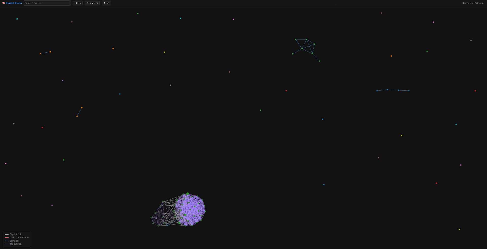
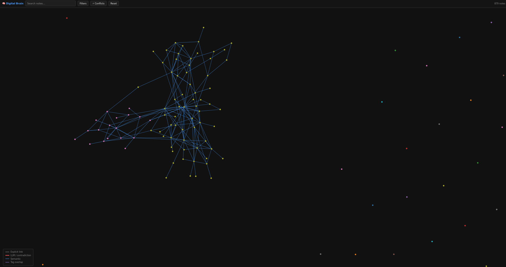

# Digital Brain — Live System Showcase

Real outputs from a working instance of the Digital Brain, running on a personal corpus of ~880 atomic notes sourced from Emacs org-mode files, authored PDFs, and philosophical writing spanning several years.

> **Architecture note — LLM agnosticism**
> The memory formation, graph retrieval, and reasoning pipelines are structurally decoupled from the text-generation layer. The examples below were produced using `mistral` running entirely offline via Ollama. Plugging in a frontier model (Claude Opus, GPT-4o, DeepSeek-R1) will improve the depth and nuance of generated insights proportionally — the graph structure and retrieval quality remain identical regardless of which LLM is attached.

---

## Table of Contents

1. [System Initialization](#1-system-initialization--graph-building)
2. [Nightly Consolidation & Auto-Wiki](#2-nightly-consolidation--auto-wiki)
3. [Intellectual Persona Distillation](#3-intellectual-persona-distillation)
4. [Knowledge Gap Analysis](#4-knowledge-gap-analysis)
5. [Neuro-Symbolic Querying](#5-neuro-symbolic-querying)
6. [Generative Synthesis](#6-generative-synthesis)
7. [Graph Visualization](#7-graph-visualization)

---

## 1. System Initialization & Graph Building

The `first_run.py` script ingests all sources, generates embeddings, and constructs the initial neuro-symbolic knowledge graph in a single guided pass.

```
$ python first_run.py --org ~/Nextcloud/brain/raw-import \
                      --pdfs ~/Nextcloud/brain/raw-import

╭──────────────────────────────────────────────────────────────────╮
│ DIGITAL BRAIN — FIRST RUN                                        │
│ This will index your entire corpus and boot the knowledge graph. │
╰──────────────────────────────────────────────────────────────────╯

Step 0/9 — Checking dependencies
  ✓ networkx
  ✓ fitz  (PDF extraction — PyMuPDF)
  ✓ Ollama running locally
  ✓ sentence-transformers
  ✓ rich
  ✓ community  (Louvain clustering)

Step 1/9 — Ingesting org-mode notes
  ✓ 953 org notes ingested

Step 2/9 — Ingesting authored PDFs
  Found 17 PDF(s) — 17 files → 27 notes
  ✓ 27 PDF notes ingested  (tagged as 'authored')

Step 4/9 — Generating embeddings
  Auto-detecting best embedding backend…
  Loading sentence-transformers: all-MiniLM-L6-v2
  Embedding 867 notes…
  ✓ Embeddings generated

Step 5/9 — Building knowledge graph
  Loading 867 notes into graph
  Added 351 tag edges
  Added 222 semantic edges  (threshold = 0.75)
  Built graph: 867 nodes, 573 edges
  ✓ Graph: 867 nodes, 573 edges

Step 6/9 — Computing PageRank + community clusters
  Centrality computed for 867 nodes
  Found 722 clusters
  ✓ 722 topic clusters detected

Step 9/9 — Exporting visualization
  ✓ Graph exported → web/index.html

╭─────────────────────────── Summary ────────────────────────────╮
│ BRAIN IS ALIVE                                                  │
│                                                                 │
│   Notes:       867                                              │
│   Edges:       573                                              │
│   Embeddings:  867                                              │
│   Clusters:    722                                              │
╰─────────────────────────────────────────────────────────────────╯
```

---

## 2. Nightly Consolidation & Auto-Wiki

The consolidation agent runs as a scheduled job. It rebuilds graph metrics, detects near-duplicates, surfaces emerging patterns (high-centrality note clusters forming without explicit links), and flags long monolithic notes for manual refactoring. The auto-wiki then writes or patches living Wikipedia-style concept pages for the top nodes.

```
$ python main.py consolidate

[consolidate] Starting nightly consolidation...
[consolidate] Step 1/6 — Rebuilding graph & metrics...
              Built graph: 867 nodes, 573 edges
[consolidate] Step 2/6 — Detecting near-duplicates...
              Found 4 near-duplicate pairs
[consolidate] Step 5/6 — Surfacing emerging patterns...

  ── Emerging patterns ────────────────────────────────────────────
  [cluster 290] O método do raciocínio a priori é completo?
                score = 0.034
  [cluster 290] Alicerce primordial do entendimento
                score = 0.019
  [cluster 290] Coisa de engomadeira
                score = 0.014
  [cluster 316] Idea: Thus Spoke Zarathustra — Building the Greatest Good
                score = 0.009

[consolidate] Step 6/6 — Auditing long manual notes...
              Flagged 23 long notes for manual human refactoring.
[consolidate] Nightly job complete.
```

```
$ python main.py wiki update --diff

[wiki] Diff-patch refresh for 11 concepts...
  ✓ o_método            (v1)
  ✓ alicerce_primordial (v1)
  ✓ coisa_de            (v1)
  ✓ uma_viagem          (v1)
  Done. 4 pages updated.
```

---

## 3. Intellectual Persona Distillation

The persona distiller reads the entire corpus and builds a structured intellectual DNA profile: topical fingerprint, stances on recurring themes, and a temporal arc showing how focus shifted over time. This profile feeds the gap finder, the generator, and the recommender.

```
$ python main.py persona build
$ python main.py persona show

============================================================
  PERSONA  v5  (2026-05-05)
============================================================

─ SELF DESCRIPTION ─────────────────────────────────────────
You are a multifaceted thinker whose corpus of 877 notes
(131,608 words) spans philosophy, science, literature, and
self-improvement. Core to your thinking is the exploration
of time and existence — with recurring references to
Hawking, Einstein, and the concept of 'Alicerce Primordial',
suggesting a deep interest in the fundamental nature of
reality.

Your writing intertwines the philosophical and the practical:
notes on productivity and personal projects sit alongside
engagements with Santo Agostinho, Bertrand Russell, and
Isaac Newton. You are drawn to Nietzsche's Zarathustra as a
lived framework, not merely as a text.

─ TOP TOPICS ────────────────────────────────────────────────
  authored            ████████████████████████████  28
  output              ████████████████████████████  28
  pdf                 ███████████████████████████   27
  wiki_page           ██████████                    10
  o_método            ██                             2

─ STANCES ───────────────────────────────────────────────────
  [o_método]    Rooted in exploring and critiquing the
                completeness of a priori reasoning, particularly
                regarding chaos, order, and entropy.

  [coisa_de]    Multidisciplinary and nuanced — views abstract
                concepts as embodying the contradictions
                inherent in human existence.

  [uma_viagem]  Theistic: holds that God created humans and
                time, as a structuring premise for other claims.

─ TEMPORAL ARC ──────────────────────────────────────────────
  2023: heavy engagement with classical philosophy + physics
  2024: pivot toward applied ethics and self-development
  2025: synthesis phase — Nietzsche, AI epistemology, identity
```

---

## 4. Knowledge Gap Analysis

The gap agent performs seven structural scans on the graph (orphan nodes, depth gaps, one-sided claims, missing canonical siblings, stale high-centrality nodes, sparse clusters, ghost references) and then calls the LLM to generate steel-man counterarguments and reading recommendations for the highest-priority findings.

```
$ python main.py gap

╔══════════════════════════════════════════════════╗
║       DIGITAL BRAIN — KNOWLEDGE GAP REPORT       ║
║       2026-05-05                                 ║
╚══════════════════════════════════════════════════╝

🔴  ORTHOGONAL — Steel-man challenges to your positions

  • Counter: Empiricism
    Against your position in 'O método do raciocínio a priori
    é completo?' — the strongest counterargument is: rationalism
    provides limited knowledge and is incomplete without
    empirical evidence.
    Represented by: Locke, Hume, Kant.
    → Read: An Essay Concerning Human Understanding — John Locke

  • Counter: Epicurean Hedonism
    Against 'Idea: Thus Spoke Zarathustra — Building the
    Greatest Good Within' — the focus on self-overcoming may
    overlook the pursuit of personal happiness as a primary goal.
    → Read: Epicurus: The Extant Remains

🟡  WIDTH — Canonical siblings you have not engaged

  • Missing: Critical Rationalism
    You have written about 'O método do raciocínio a priori'
    but not Critical Rationalism — which directly addresses
    the limits of deductive systems using a different framing.
    → Explore: Karl Popper, The Logic of Scientific Discovery

🔴  DEPTH — Referenced but underdeveloped

  • Develop: 'Thus Spoke Zarathustra — The Overhuman May Seem Evil'
    Referenced 6× across your corpus but only 55 words long.
    This is a load-bearing node in your Nietzsche cluster.
    → Write a full essay on this note.
```

---

## 5. Neuro-Symbolic Querying

The query agent combines semantic vector retrieval with graph traversal to locate relevant notes, then synthesises a cited answer. The strategy (semantic / temporal / graph / hybrid) is chosen automatically based on question structure.

```
$ python main.py query \
  "Based on my notes, what is my interpretation of Zarathustra, \
   what similar stuff is there in the literature?"

==================================================
  QUESTION
==================================================
Based on my notes, what is my interpretation of Zarathustra,
and what similar ideas exist in the broader literature?

==================================================
  ANSWER
==================================================
Your engagement with Zarathustra centres on three interlocking themes:

1. Imposing Good and Evil Upon the Self
   Your notes argue that labelling oneself with fixed moral
   constructs is ultimately limiting — the Overhuman transcends
   inherited categories rather than internalising them.

2. The Natural, After Taming
   You admire the figure who achieves naturalness only after
   gaining conscious control over their drives — not raw
   instinct, but disciplined instinct.

3. The Power of Dead Past Moments
   You return repeatedly to the idea that past moments of
   intense emotion continue to exert force on the present,
   even after they have technically ended — a distinctly
   Nietzschean take on time and will.

Taken together, these suggest a reading of Zarathustra as a
practical existential framework rather than as metaphysics.
Comparable threads in the literature: Emerson's self-reliance
essays, Thoreau's Walden (disciplined naturalism), and the
Stoic literature on amor fati — particularly Marcus Aurelius.

── Sources  [hybrid, confidence = 0.67] ─────────────────────
  • Idea: Thus Spoke Zarathustra — Imposing Good and Evil Upon the Self
  • Idea: Thus Spoke Zarathustra — The Natural, After Taming
  • Idea: Thus Spoke Zarathustra — The Power of Dead Past Moments
  • Idea: Thus Spoke Zarathustra — Spirit as Life of Life
```

---

## 6. Generative Synthesis

Given a topic or seed, the generator gathers all relevant notes from the graph and synthesises them into a coherent essay written in the author's voice. The result is saved as a new atomic note and added back to the graph.

```
$ python main.py generate synthesize "Coisa de engomadeira" --save

──────────────────────────────────────────────────────────────────
  SYNTHESIS: Coisa De Engomadeira
──────────────────────────────────────────────────────────────────

Title: Coisa De Engomadeira — A Metaphor for Human Existence
       in the Face of Chaos and Order

The concept of "Coisa de engomadeira," as depicted by José de
Almada Negreiros in his 1938 painting, serves as a metaphor for
human existence — particularly for those caught between the
demand for order and the chaos that underlies it.

In the painting, a woman — dishevelled and structurally
displaced, shoulders and hips pulled away from her body's
axis — is absorbed in her labour. The ironing board becomes
both instrument and symbol: the attempt to impose flatness
on something that resists it.

This maps directly onto the question explored in the corpus:
whether a priori reasoning is ever complete, or whether the
act of flattening experience into logical structure always
loses something essential. The 'Alicerce Primordial' notes
suggest the answer — that foundational structures exist, but
they are felt before they are formalised.

In essence, "Coisa de engomadeira" is a portrait of
consciousness mid-effort: not triumphant, not defeated, but
engaged with the irreducible tension between what is and
what we need it to be.

INFO: Synthesis note saved → id: synth_coisa_de_engomadeira
```

---

## 7. Graph Visualization

The knowledge graph is exported as D3.js JSON and served locally. Nodes are sized by PageRank centrality and coloured by community cluster. Edge types are colour-coded: white = explicit org link, blue = semantic similarity, purple = tag overlap, red = LLM-extracted contradiction.

```
$ python main.py visualize

[export] Generating graph JSON...
[graph]  879 nodes, 720 edges
[graph]  724 clusters detected
[export] Saved → web/graph_data.json
         Serving at http://localhost:8000
```

**Dense tag-overlap cluster** — the purple mesh in the lower centre is the authored PDF cluster, where 27 PDF notes share tags and cross-link heavily. The isolated dots around the perimeter are orphan notes flagged by the gap agent.



**Semantic similarity network** — with tag edges filtered out, the blue semantic graph reveals a large connected component of Nietzsche, epistemology, and physics notes that share embedding space despite having different explicit tags. Pink nodes are a separate cluster of Portuguese-language writing.



> **To view locally:** `python main.py visualize` then open `http://localhost:8000` in any browser. Use the Filters button to toggle edge types, the search bar to locate specific notes, and the timeline slider to filter by note date.

---

## Running It Yourself

```bash
# Clone and install
git clone https://github.com/giljorge0/Digital-Brain-Project
cd Digital-Brain-Project
pip install -r requirements.txt

# Configure LLM (pick one)
export ANTHROPIC_API_KEY=sk-ant-...    # Claude
export OPENAI_API_KEY=sk-...           # GPT-4
# or: ollama pull mistral              # fully local, no key needed

# First run — point at your notes
python first_run.py --org ~/your-notes/ --pdfs ~/your-pdfs/

# Daily use
python main.py query "What do I actually think about X?"
python main.py gap
python main.py generate synthesize "your topic"
python main.py visualize

# Nightly maintenance (add to cron)
0 2 * * * python /path/to/Digital-Brain-Project/scripts/consolidate.py
```

---

*All outputs above were generated from a real personal corpus. The graph structure, gap detection, and retrieval are model-agnostic — only the quality of generated text changes with the LLM.*
