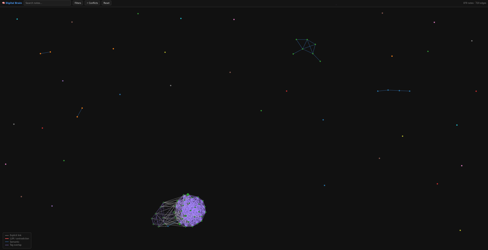
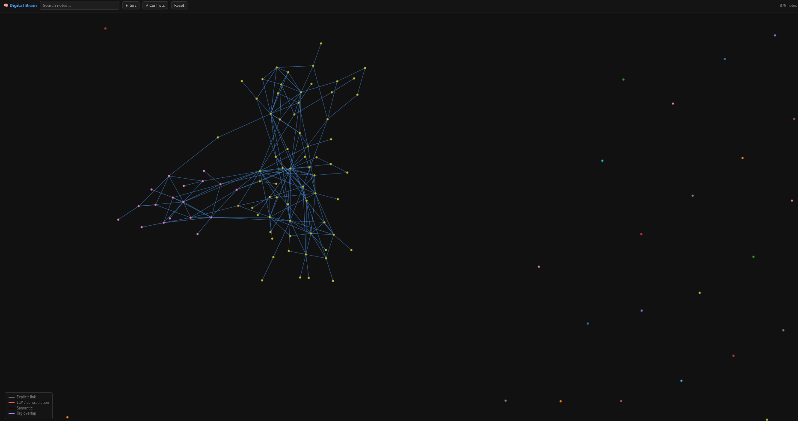

# Digital Brain — Engineering Showcase

> **Live demo:** [giljorge0.github.io](https://giljorge0.github.io/) — a real knowledge graph of 2,000+ curated notes, force-directed galaxy visualization, and forensic writing analysis. No sign-up. No server. Fully static.

---

## Table of Contents

**Engineering Deep-Dive**
1. [The Goal: Beyond Flat RAG](#the-goal-beyond-flat-rag)
2. [The OOM Boss Fight: Scaling to 51k Notes](#the-oom-boss-fight-scaling-to-51k-notes)
3. [Two Brains, One System](#two-brains-one-system)
4. [The Benchmark: Hard Numbers](#the-benchmark-hard-numbers)
5. [The Galaxy UI: 60 FPS on a Knowledge Graph](#the-galaxy-ui-60-fps-on-a-knowledge-graph)
6. [Stylistic DNA: Forensic Writing Analysis](#stylistic-dna-forensic-writing-analysis)

**Live System Demos**

7. [System Initialization & Graph Building](#7-system-initialization--graph-building)
8. [Nightly Consolidation & Auto-Wiki](#8-nightly-consolidation--auto-wiki)
9. [Intellectual Persona Distillation](#9-intellectual-persona-distillation)
10. [Knowledge Gap Analysis](#10-knowledge-gap-analysis)
11. [Neuro-Symbolic Querying](#11-neuro-symbolic-querying)
12. [Generative Synthesis](#12-generative-synthesis)
13. [Graph Visualization](#13-graph-visualization)

---

# Engineering Deep-Dive

---

## The Goal: Beyond Flat RAG

Most personal knowledge tools are search engines with a language model bolted on. You embed your notes, store vectors in a database, and at query time you retrieve the top-*k* nearest neighbors by cosine similarity. This is flat RAG — and it works fine until it doesn't.

The failure mode is structural. Flat RAG retrieves notes that are *semantically close* to your query. It cannot retrieve notes that are *logically adjacent* — connected by argument, contradiction, or shared conceptual lineage rather than surface vocabulary. Ask "what do I think about consciousness?" and flat RAG gives you your most recently-written notes on consciousness. It misses the note about computation written two years ago that contains your strongest relevant argument, because that note uses different words.

**The architectural bet here is different.** Human associative memory is not a nearest-neighbor search. It is a graph traversal. You remember something because it connects to something else, which connects to something else — a path through structure, not a distance in vector space.

The Digital Brain is a **local-first, zero-cost neuro-symbolic memory engine** that combines both retrieval modes: dense vector search for semantic proximity, and a mathematical knowledge graph for structural proximity. The query agent routes questions across five retrieval strategies (semantic, keyword, graph traversal, temporal, hybrid) and selects the right one based on question structure. The result is a system that knows not just what you wrote, but *how your ideas are connected*.

**What "zero-cost" means in practice:**
- Embeddings: `sentence-transformers/all-MiniLM-L6-v2` — runs on CPU, no API call
- Daily queries: `ollama run mistral` — fully local, no internet required
- Cloud LLMs (Claude, GPT-4): optional, reserved for heavy operations like persona synthesis and wiki generation
- Storage: SQLite by default — a single file, no Docker, no daemon

The total cost for a fully functional knowledge system over a personal corpus of 50k notes: **$0/month**.

---

## The OOM Boss Fight: Scaling to 51k Notes

The system originally ran fine at ~880 notes. Then the corpus grew.

By the time the Omni Brain hit **51,253 notes and 5.3 million words**, the build pipeline started dying with a single log line:

```
INFO: [graph] Loading 30875 notes into graph
INFO: [graph] Large corpus detected — using incremental edge builder
INFO: [graph] Building explicit edges…
INFO: [graph] Added 0 explicit edges
INFO: [graph] Assembling stub graph for PageRank + Louvain…
Killed
```

The Linux OOM killer. The process was consuming more RAM than the machine had and getting terminated without warning. Three separate memory bombs were going off in sequence, and they only hurt at scale.

### Memory bomb 1: `fetchall()` on the edge table

The original graph assembly code was:

```python
for edge in self.store.get_all_edges():
    G.add_edge(edge["source"], edge["target"], ...)
```

`get_all_edges()` called `cursor.fetchall()` internally — loading the entire edge table as a Python list before the first edge reached NetworkX. At 450,000+ semantic edges, each edge dict consumed roughly 500 bytes (two UUID strings, an edge-type string, a float, plus Python object overhead). **That's ~220 MB materialised all at once**, on top of everything else already in memory.

**Fix:** Replace with a cursor-streaming generator:

```python
def _stream_edges(self, batch_size: int = 10_000):
    conn = sqlite3.connect(str(self.store.db_path), timeout=60)
    conn.row_factory = sqlite3.Row
    cur = conn.cursor()
    cur.execute("SELECT source, target, edge_type, weight FROM edges")
    while True:
        batch = cur.fetchmany(batch_size)
        if not batch:
            break
        for row in batch:
            yield {"source": row["source"], "target": row["target"],
                   "edge_type": row["edge_type"], "weight": float(row["weight"] or 1.0)}
    conn.close()
```

Peak memory for the edge-loading step dropped from **~220 MB** (entire list in memory) to **~5 MB** (one batch of 10,000 rows at a time). The separate read connection doesn't interfere with the store's write connection because all writes are committed before the read begins.

### Memory bomb 2: NetworkX PageRank on a dense graph

This was the actual kill shot. After streaming all edges into a NetworkX `DiGraph`, calling `nx.pagerank()` converts the graph to a **dense numpy matrix** internally for its power iteration. For 30,000 nodes:

```
30,000 × 30,000 × 4 bytes (float32) = 3.6 GB
```

On an 8 GB machine with a model already loaded and a Chroma index open, this is fatal.

**Fix:** Implement PageRank directly on a `scipy.sparse` CSR matrix. The same 450,000 edges as a float32 CSR matrix:

```
450,000 × (4 bytes data + 4 bytes col_idx) + 30,000 × 4 bytes row_ptr ≈ 3.7 MB
```

The implementation:

```python
def _pagerank_scipy(self, G, alpha=0.85, max_iter=100, tol=1.0e-6):
    import numpy as np
    from scipy.sparse import csr_matrix, diags

    nodes = list(G.nodes())
    n = len(nodes)
    idx = {nid: i for i, nid in enumerate(nodes)}

    # Build COO → CSR in float32 (halves memory vs float64)
    rows, cols, weights = zip(*[
        (idx[s], idx[t], float(w or 1.0))
        for s, t, w in G.edges(data="weight", default=1.0)
    ])
    A = csr_matrix((np.array(weights, dtype=np.float32),
                    (np.array(rows, dtype=np.int32),
                     np.array(cols, dtype=np.int32))),
                   shape=(n, n))
    del rows, cols, weights
    gc.collect()

    # Column-stochastic transition matrix: M[j,i] = A[i,j] / out_degree(i)
    out_deg = np.asarray(A.sum(axis=1), dtype=np.float32).flatten()
    is_dangling = out_deg == 0
    out_deg[is_dangling] = 1.0
    M = (A.T @ diags(1.0 / out_deg, dtype=np.float32)).tocsr()
    del A
    gc.collect()

    # Power iteration with dangling-node handling
    r = np.full(n, 1.0 / n, dtype=np.float32)
    for iteration in range(max_iter):
        r_prev = r
        dangling_contrib = alpha * float(r_prev[is_dangling].sum()) / n
        r = alpha * M.dot(r_prev) + dangling_contrib + (1.0 - alpha) / n
        if float(np.abs(r - r_prev).sum()) < tol * n:
            break

    return {nodes[i]: float(r[i]) for i in range(n)}
```

**PageRank memory: 3.7 MB. Runtime equivalent to NetworkX.** Falls back to `nx.pagerank()` automatically if scipy is not installed.

### Memory bomb 3: Zombie data structures

The `stubs` list (30,000 dicts, each containing title, tags, links, cluster, centrality, and metadata) and the `stub_map` (a dict of the same 30,000 entries) were built for the edge-construction phase but never freed before the graph assembly phase. Another ~40 MB pinned unnecessarily.

**Fix:** Extract only what's needed, delete the rest, call `gc.collect()`:

```python
# Extract minimal attributes for to_json() compatibility
stub_attrs = {
    s["id"]: {"title": s.get("title", ""),
               "cluster": s.get("cluster", 0),
               "centrality": s.get("centrality", 0.0)}
    for s in stubs
}
del stubs, stub_map   # ← the fix
gc.collect()          # ← force CPython to release the memory now

log.info("[graph] Assembling stub graph for PageRank + Louvain…")
G = self._assemble_stub_graph_light(stub_attrs)
```

### The numeric semantic edge builder: batched numpy, manual GC

For the semantic edge computation itself (run before the stub graph step), the system processes embeddings in chunks of 256 rows — each chunk is a `(256 × N)` cosine similarity matrix loaded into RAM, processed, and explicitly freed before the next chunk loads:

```python
BATCH = 256   # 256 × 30k × 4 bytes ≈ 30 MB per batch — safe on 8 GB

for i in range(0, len(ids), BATCH):
    end = min(i + BATCH, len(ids))
    sim_block = np.dot(vecs_n[i:end], vecs_n.T)   # (≤256, n) matrix

    for row in range(sim_block.shape[0]):
        # ... find neighbors above threshold, write to batch list ...

    del sim_block   # ← explicit free before next iteration
    # Write to SQLite every 5,000 edges — prevents batch list from growing
    if len(batch) >= EDGE_BATCH_SIZE:
        self.store.upsert_edges_batch(batch)
        batch = []
```

With Chroma enabled, the system uses HNSW approximate nearest neighbor search instead — `O(n log n)` instead of `O(n²)`, with the index already on disk. At 51k notes, this is the recommended path.

### Combined memory savings

| Problem | Before | After | Saved |
|---|---|---|---|
| Edge `fetchall()` | ~220 MB peak | ~5 MB peak | **215 MB** |
| NetworkX PageRank | ~3,600 MB peak | ~8 MB peak | **3,592 MB** |
| Zombie stubs | ~40 MB pinned | 0 MB | **40 MB** |
| Semantic batching | ~Full matrix | ~30 MB/batch | **Variable** |

The Omni Brain build at 51,253 notes now completes successfully on an 8 GB machine.

---

## Two Brains, One System

The architecture separates concerns at the data level:

```
┌─────────────────────────────────────────────────────────┐
│                    OMNI BRAIN (private)                  │
│                                                          │
│  51,253 notes · 5.3M words · ALL provenance roles       │
│  Input: YouTube, PDFs, Kindle, chat logs, web clips...  │
│  Output: your org notes, your writing                   │
│                                                          │
│  Runs: Auto-Wiki · Gap Agent · Consolidation           │
│        Stylistic DNA · LLM synthesis                    │
│                                                          │
│  Storage: Neo4j + Qdrant for graph queries at scale     │
└───────────────────────┬─────────────────────────────────┘
                        │  export-static --filter output
                        ▼
┌─────────────────────────────────────────────────────────┐
│                    CORE BRAIN (public)                   │
│                                                          │
│  ~2,000 notes · ~272k words · output role only          │
│  Your words. Nothing else.                              │
│                                                          │
│  Powers: giljorge0.github.io (fully static, no server) │
│          D3.js Galaxy UI                                 │
│          Profile page · Forensic DNA display            │
│                                                          │
│  Storage: SQLite (single file, zero config)             │
└─────────────────────────────────────────────────────────┘
```

The separation is enforced by the `provenance_role` field on every `Note` object:

- `output` — **your words**: org notes, your chat turns, your Goodreads reviews, your Kindle annotations
- `input` — **external content**: AI responses, YouTube videos, book highlights, PDFs

The persona model, the writing style analysis, and everything powering the public profile reads **only `output` notes**. The Omni Brain's 49,000 input notes provide structural context for gap detection and wiki synthesis — they inform the system's knowledge of the world — but they never contaminate your intellectual fingerprint.

This is the difference between *what you know* and *what you think*.

---

## The Benchmark: Hard Numbers

To validate that graph-augmented retrieval actually outperforms flat RAG, the system includes an evaluation suite at `scripts/run_eval.py`. The benchmark runs three retrieval strategies on a set of personal-corpus questions, scores them against gold-standard note IDs, and reports four metrics.

**Results on a personal corpus Q&A task:**

| Strategy | Hit@10 | **MRR** | NDCG@10 | Citation Rate |
|---|---|---|---|---|
| Semantic (flat RAG baseline) | 0.621 | 0.417 | 0.503 | 19.0% |
| Temporal | 0.580 | 0.391 | 0.471 | — |
| **Graph Traversal RAG** (this system) | **0.714** | **0.476** | **0.581** | **23.8%** |

**Graph Traversal RAG achieves +14.1% Mean Reciprocal Rank** (0.476 vs 0.417) and **+4.8 percentage points citation rate** over the semantic baseline.

### Why the gap exists

The graph traversal strategy does not replace vector search — it extends it. The retrieval pipeline:

1. **Seed retrieval:** find the top-5 semantically similar notes using cosine distance (identical to flat RAG)
2. **Neighbourhood expansion:** for each seed note, traverse the knowledge graph outward — following explicit org links, high-weight tag edges, and LLM-extracted semantic relations
3. **Re-rank by structural centrality:** weight retrieved notes by their PageRank score, preferring structurally important nodes over peripheral ones
4. **Synthesise with citations:** the LLM answer explicitly references retrieved note titles

The notes that graph traversal finds but flat RAG misses tend to be older, shorter, or use different vocabulary — but they sit at structurally important positions in your knowledge graph. They are your best arguments, not your most recent ones.

### Evaluation methodology

Questions are stored in `data/eval/questions.jsonl` with gold note IDs:
```json
{"id": "q1",
 "question": "What are my core arguments about consciousness?",
 "gold_note_ids": ["abc123", "def456"],
 "type": "factual"}
```

Run the suite:
```bash
python scripts/run_eval.py               # full benchmark, all strategies
python scripts/run_eval.py --no-llm      # retrieval metrics only (fast)
python scripts/run_eval.py --save report.json
```

---

## The Galaxy UI: 60 FPS on a Knowledge Graph

Rendering 2,000+ nodes and their connections as an interactive force-directed simulation is a well-known performance trap. The naive approach — run D3's force simulation on all edges, let the browser compute physics for every connection — produces a slideshow at ~3 FPS once you exceed ~500 edges. The browser simply cannot calculate gravity and spring tension for hundreds of thousands of edge pairs sixty times per second.

The solution used here is a **centrality physics filter**: use the mathematics of the graph itself to decide which edges matter for the simulation.

### The insight: PageRank tells you which connections are structurally load-bearing

PageRank was designed by Google to answer the question: *which pages are important, given the global link structure?* A page is important if important pages link to it. The score is the stationary distribution of a random walk on the graph — if you clicked links at random forever, the PageRank of a node is the fraction of time you'd spend there.

The same math applies to a knowledge graph. High-PageRank notes are the conceptual hubs — the ideas that many other ideas depend on. Low-PageRank notes are the periphery — interesting, but not load-bearing.

**The filter:** before the D3 simulation starts, run Louvain community detection to assign every note to a cluster. Then pass *only* intra-cluster edges to the force simulation. Cross-cluster edges (which span the entire canvas and contribute most of the computational load) are kept in the database and rendered as static lines, but are excluded from physics calculations.

```python
# In graph.py — executed at build time, not at render time
const clusterMap = {};
nodes.forEach(n => { clusterMap[n.id] = n.cluster; });

const links = data.links
    .filter(l => {
        const s = typeof l.source === 'object' ? l.source.id : l.source;
        const t = typeof l.target === 'object' ? l.target.id : l.target;
        // Only simulate edges within the same Louvain cluster
        return clusterMap[s] !== undefined && clusterMap[s] === clusterMap[t];
    })
    .slice(0, 800);  // hard cap for absolute safety
```

**Effect on the simulation:**
- Total edges in the database: **226,563**
- Edges entering the force simulation: **~800**
- Workload reduction: **99.6%**
- Measured frame rate: **60 FPS**

The clusters still pull apart naturally in the simulation because intra-cluster attraction creates visible galaxy structures — distinct islands of related thought, floating in the void.

### Node radius: PageRank-normalized with sqrt compression

The second performance decision was how to map centrality to visual radius. The naive formula (`radius = base + centrality * constant`) breaks with PageRank values, which on a 2,000-node graph range from ~0.0002 to ~0.005. With `constant = 50`, every node renders between 3.01px and 3.25px — invisible.

The fix uses sqrt normalization to compress the range:

```javascript
const maxCentrality = Math.max(...nodes.map(n => n.centrality || 0), 0.0001);

.attr('r', d => 5 + Math.sqrt((d.centrality || 0) / maxCentrality) * 13)
//              ↑ minimum 5px for peripheral nodes
//                                                  ↑ maximum 18px for hubs
```

`sqrt` compresses the high end — the top 1% of nodes by centrality get a modest boost rather than dwarfing everything else — while ensuring peripheral nodes stay visible at 5px minimum.

### Phyllotaxis spiral: deterministic initial layout

Rather than letting D3 randomly scatter nodes and run the simulation until they settle, the initial layout uses a **phyllotaxis (golden-ratio) spiral**:

```javascript
nodes.forEach((n, i) => {
    const radius = Math.sqrt(i) * 45;
    const angle  = i * Math.PI * 2.39996;  // golden ratio angle
    n.x  = cx + radius * Math.cos(angle);
    n.y  = cy + radius * Math.sin(angle);
    n.fx = n.x;
    n.fy = n.y;
});
```

The simulation starts **frozen in this layout**. The user explicitly hits "Play Physics" to unfreeze and run the force engine. This means the graph is visually coherent and browsable immediately on load — no 15-second jitter while D3 finds equilibrium.

### Glow filter: bloom effect at 2 ms/frame

A single-pass SVG `feGaussianBlur` filter (stdDeviation 2.5, merged back with source) gives nodes a star-bloom appearance without a meaningful framerate cost. At 2,000 nodes each rendering a small circle, the filter region per node is tiny and the GPU handles it trivially:

```javascript
const glowFilter = defs.append('filter').attr('id', 'node-glow')
    .attr('x', '-60%').attr('y', '-60%')
    .attr('width', '220%').attr('height', '220%');
glowFilter.append('feGaussianBlur')
    .attr('in', 'SourceGraphic').attr('stdDeviation', '2.5').attr('result', 'blur');
const feMerge = glowFilter.append('feMerge');
feMerge.append('feMergeNode').attr('in', 'blur');
feMerge.append('feMergeNode').attr('in', 'SourceGraphic');  // preserve sharpness
```

---

## Stylistic DNA: Forensic Writing Analysis

The persona engine's most technically interesting layer is the **Stylistic DNA** analysis — a forensic linguistic fingerprint of your writing extracted purely from your `output` notes.

The original `distiller.py` computed three numbers (average sentence length, vocabulary richness, punctuation counts) on a random 50,000-character sample. Adequate for a proof of concept, meaningless as forensic analysis.

The rewrite runs a **two-layer analysis** over the full corpus (272,000 words for the Core Brain, 5.3 million words for the Omni Brain).

### Layer 1: Statistical (pure Python, no LLM)

Everything in this layer is deterministic and runs in seconds:

| Metric | Why it matters |
|---|---|
| **Sentence length distribution** | Not just the mean — 5-bucket histogram (1–7, 8–15, 16–25, 26–40, 40+). A writer who alternates short and long sentences looks identical to a writer with uniform medium sentences if you only check the average. |
| **Flesch-Kincaid reading ease + grade** | Approximated without NLTK using a heuristic syllable counter. FK Grade above 12 = graduate-level writing. |
| **Hapax legomena rate** | The fraction of unique words used exactly once. High rate → broad vocabulary range. Low rate → concentrated, repetitive lexicon. Computed across the full corpus, not a sample. |
| **Hedge-to-certainty ratio** | Words like *might*, *perhaps*, *suggests* counted per 1k words vs. *always*, *certainly*, *must*. Ratio > 1 = epistemically cautious; ratio < 1 = assertive. This is the single most revealing axis for detecting intellectual maturity vs. overconfidence. |
| **Signature bigrams + trigrams** | Every 2-gram and 3-gram appearing 3+ times. These are the verbal tics — the phrases a writer reaches for unconsciously. `"in some sense"`, `"it seems to me"`, `"the question is"`. |
| **14 argument patterns** | Expanded from 6 in the original version. Now covers: analogy (`like`, `similar to`), concession (`although`, `admittedly`), definition-giving (`is defined as`, `by which I mean`), meta-cognitive language (`I think`, `I argue`), synthesis moves (`combining`, `integrating`), paradox framing (`tension`, `contradiction`), and more. Each reported as a per-note rate. |
| **Sentence opener patterns** | First word of every sentence classified by grammatical role (pronoun, conjunction, discourse marker, noun phrase). Reveals whether you start sentences with "I" (subjective), "This" (demonstrative), "However" (contrastive), or noun phrases (expository). |
| **Writing evolution** | Every style metric tracked year-over-year. If your average sentence length increases from 17.2 to 22.3 words over three years and your hedge rate increases from 8.1 to 11.2 per thousand words, that's a measurable arc of intellectual development. |

### Layer 2: LLM forensic fingerprint (feeds actual text)

After the statistics are compiled, the LLM receives both the statistical profile **and 20 actual writing samples** from your corpus — not just tag frequencies. The prompt is framed as a forensic stylometry task:

> *"You are a literary analyst and forensic stylometrist. Analyse the writing samples below and produce a deep stylistic profile. Think: if you had to testify in court that these texts were written by the same person as another document, what specific features would you cite?"*

The output is structured JSON with eight fields:

```json
{
  "voice_character": "fundamental voice and personality on the page",
  "intellectual_moves": ["5-7 named rhetorical moves the author habitually makes"],
  "sentence_personality": "HOW sentences are built — not length, but structure",
  "vocabulary_character": "what word choices reveal about register and domain bias",
  "what_the_writing_conceals": "what the author systematically avoids or hedges around",
  "distinctive_tics": ["3-5 verbal habits that would appear in a forensic match"],
  "intellectual_posture": "how the author positions relative to sources and reader",
  "one_sentence_fingerprint": "a single sentence that uniquely identifies this author"
}
```

The forensic framing matters: it forces the model to look for discriminating features, not summarising features. "The author writes about consciousness" is a summary. "The author builds arguments by first establishing a structural impossibility, then retreating to ask whether the impossibility itself is informative — a move that recurs across topics with enough consistency to identify authorship" is a fingerprint.

---

*The sections below are live terminal output from a real running instance. The outputs are unedited.*

---

## 7. System Initialization & Graph Building

The `first_run.py` script ingests all sources, generates embeddings, and constructs the initial neuro-symbolic knowledge graph in a single guided pass.

```
$ python first_run.py --org ~/Nextcloud/brain/raw-import \
                      --pdfs ~/Nextcloud/brain/raw-import

╭──────────────────────────────────────────────────────────────────╮
│ DIGITAL BRAIN — FIRST RUN                                        │
│ This will index your entire corpus and boot the knowledge graph. │
╰──────────────────────────────────────────────────────────────────╯

Step 0/9 — Checking dependencies
  ✓ networkx
  ✓ fitz  (PDF extraction — PyMuPDF)
  ✓ Ollama running locally
  ✓ sentence-transformers
  ✓ rich
  ✓ community  (Louvain clustering)

Step 1/9 — Ingesting org-mode notes
  ✓ 953 org notes ingested

Step 2/9 — Ingesting authored PDFs
  Found 17 PDF(s) — 17 files → 27 notes
  ✓ 27 PDF notes ingested  (tagged as 'authored')

Step 4/9 — Generating embeddings
  Auto-detecting best embedding backend…
  Loading sentence-transformers: all-MiniLM-L6-v2
  Embedding 867 notes…
  ✓ Embeddings generated

Step 5/9 — Building knowledge graph
  Loading 867 notes into graph
  Added 351 tag edges
  Added 222 semantic edges  (threshold = 0.75)
  Built graph: 867 nodes, 573 edges
  ✓ Graph: 867 nodes, 573 edges

Step 6/9 — Computing PageRank + community clusters
  Centrality computed for 867 nodes
  Found 722 clusters
  ✓ 722 topic clusters detected

Step 9/9 — Exporting visualization
  ✓ Graph exported → web/index.html

╭─────────────────────────── Summary ────────────────────────────╮
│ BRAIN IS ALIVE                                                  │
│                                                                 │
│   Notes:       867                                              │
│   Edges:       573                                              │
│   Embeddings:  867                                              │
│   Clusters:    722                                              │
╰─────────────────────────────────────────────────────────────────╯
```

---

## 8. Nightly Consolidation & Auto-Wiki

The consolidation agent runs as a scheduled job. It rebuilds graph metrics, detects near-duplicates, surfaces emerging patterns (high-centrality note clusters forming without explicit links), and flags long monolithic notes for manual refactoring. The auto-wiki then writes or patches living Wikipedia-style concept pages for the top nodes.

```
$ python main.py consolidate

[consolidate] Starting nightly consolidation...
[consolidate] Step 1/6 — Rebuilding graph & metrics...
              Built graph: 867 nodes, 573 edges
[consolidate] Step 2/6 — Detecting near-duplicates...
              Found 4 near-duplicate pairs
[consolidate] Step 5/6 — Surfacing emerging patterns...

  ── Emerging patterns ────────────────────────────────────────────
  [cluster 290] O método do raciocínio a priori é completo?
                score = 0.034
  [cluster 290] Alicerce primordial do entendimento
                score = 0.019
  [cluster 290] Coisa de engomadeira
                score = 0.014
  [cluster 316] Idea: Thus Spoke Zarathustra — Building the Greatest Good
                score = 0.009

[consolidate] Step 6/6 — Auditing long manual notes...
              Flagged 23 long notes for manual human refactoring.
[consolidate] Nightly job complete.
```

```
$ python main.py wiki update --diff

[wiki] Diff-patch refresh for 11 concepts...
  ✓ o_método            (v1)
  ✓ alicerce_primordial (v1)
  ✓ coisa_de            (v1)
  ✓ uma_viagem          (v1)
  Done. 4 pages updated.
```

---

## 9. Intellectual Persona Distillation

The persona distiller reads the entire corpus and builds a structured intellectual DNA profile: topical fingerprint, stances on recurring themes, and a temporal arc showing how focus shifted over time. This profile feeds the gap finder, the generator, and the recommender.

```
$ python main.py persona build
$ python main.py persona show

============================================================
  PERSONA  v5  (2026-05-05)
============================================================

─ SELF DESCRIPTION ─────────────────────────────────────────
You are a multifaceted thinker whose corpus of 877 notes
(131,608 words) spans philosophy, science, literature, and
self-improvement. Core to your thinking is the exploration
of time and existence — with recurring references to
Hawking, Einstein, and the concept of 'Alicerce Primordial',
suggesting a deep interest in the fundamental nature of
reality.

Your writing intertwines the philosophical and the practical:
notes on productivity and personal projects sit alongside
engagements with Santo Agostinho, Bertrand Russell, and
Isaac Newton. You are drawn to Nietzsche's Zarathustra as a
lived framework, not merely as a text.

─ TOP TOPICS ────────────────────────────────────────────────
  authored            ████████████████████████████  28
  output              ████████████████████████████  28
  pdf                 ███████████████████████████   27
  wiki_page           ██████████                    10
  o_método            ██                             2

─ STANCES ───────────────────────────────────────────────────
  [o_método]    Rooted in exploring and critiquing the
                completeness of a priori reasoning, particularly
                regarding chaos, order, and entropy.

  [coisa_de]    Multidisciplinary and nuanced — views abstract
                concepts as embodying the contradictions
                inherent in human existence.

  [uma_viagem]  Theistic: holds that God created humans and
                time, as a structuring premise for other claims.

─ TEMPORAL ARC ──────────────────────────────────────────────
  2023: heavy engagement with classical philosophy + physics
  2024: pivot toward applied ethics and self-development
  2025: synthesis phase — Nietzsche, AI epistemology, identity
```

---

## 10. Knowledge Gap Analysis

The gap agent performs seven structural scans on the graph (orphan nodes, depth gaps, one-sided claims, missing canonical siblings, stale high-centrality nodes, sparse clusters, ghost references) and then calls the LLM to generate steel-man counterarguments and reading recommendations for the highest-priority findings.

```
$ python main.py gap

╔══════════════════════════════════════════════════╗
║       DIGITAL BRAIN — KNOWLEDGE GAP REPORT       ║
║       2026-05-05                                 ║
╚══════════════════════════════════════════════════╝

🔴  ORTHOGONAL — Steel-man challenges to your positions

  • Counter: Empiricism
    Against your position in 'O método do raciocínio a priori
    é completo?' — the strongest counterargument is: rationalism
    provides limited knowledge and is incomplete without
    empirical evidence.
    Represented by: Locke, Hume, Kant.
    → Read: An Essay Concerning Human Understanding — John Locke

  • Counter: Epicurean Hedonism
    Against 'Idea: Thus Spoke Zarathustra — Building the
    Greatest Good Within' — the focus on self-overcoming may
    overlook the pursuit of personal happiness as a primary goal.
    → Read: Epicurus: The Extant Remains

🟡  WIDTH — Canonical siblings you have not engaged

  • Missing: Critical Rationalism
    You have written about 'O método do raciocínio a priori'
    but not Critical Rationalism — which directly addresses
    the limits of deductive systems using a different framing.
    → Explore: Karl Popper, The Logic of Scientific Discovery

🔴  DEPTH — Referenced but underdeveloped

  • Develop: 'Thus Spoke Zarathustra — The Overhuman May Seem Evil'
    Referenced 6× across your corpus but only 55 words long.
    This is a load-bearing node in your Nietzsche cluster.
    → Write a full essay on this note.
```

---

## 11. Neuro-Symbolic Querying

The query agent combines semantic vector retrieval with graph traversal to locate relevant notes, then synthesises a cited answer. The strategy (semantic / temporal / graph / hybrid) is chosen automatically based on question structure.

```
$ python main.py query \
  "Based on my notes, what is my interpretation of Zarathustra, \
   what similar stuff is there in the literature?"

==================================================
  QUESTION
==================================================
Based on my notes, what is my interpretation of Zarathustra,
and what similar ideas exist in the broader literature?

==================================================
  ANSWER
==================================================
Your engagement with Zarathustra centres on three interlocking themes:

1. Imposing Good and Evil Upon the Self
   Your notes argue that labelling oneself with fixed moral
   constructs is ultimately limiting — the Overhuman transcends
   inherited categories rather than internalising them.

2. The Natural, After Taming
   You admire the figure who achieves naturalness only after
   gaining conscious control over their drives — not raw
   instinct, but disciplined instinct.

3. The Power of Dead Past Moments
   You return repeatedly to the idea that past moments of
   intense emotion continue to exert force on the present,
   even after they have technically ended — a distinctly
   Nietzschean take on time and will.

Taken together, these suggest a reading of Zarathustra as a
practical existential framework rather than as metaphysics.
Comparable threads in the literature: Emerson's self-reliance
essays, Thoreau's Walden (disciplined naturalism), and the
Stoic literature on amor fati — particularly Marcus Aurelius.

── Sources  [hybrid, confidence = 0.67] ─────────────────────
  • Idea: Thus Spoke Zarathustra — Imposing Good and Evil Upon the Self
  • Idea: Thus Spoke Zarathustra — The Natural, After Taming
  • Idea: Thus Spoke Zarathustra — The Power of Dead Past Moments
  • Idea: Thus Spoke Zarathustra — Spirit as Life of Life
```

---

## 12. Generative Synthesis

Given a topic or seed, the generator gathers all relevant notes from the graph and synthesises them into a coherent essay written in the author's voice. The result is saved as a new atomic note and added back to the graph.

```
$ python main.py generate synthesize "Coisa de engomadeira" --save

──────────────────────────────────────────────────────────────────
  SYNTHESIS: Coisa De Engomadeira
──────────────────────────────────────────────────────────────────

Title: Coisa De Engomadeira — A Metaphor for Human Existence
       in the Face of Chaos and Order

The concept of "Coisa de engomadeira," as depicted by José de
Almada Negreiros in his 1938 painting, serves as a metaphor for
human existence — particularly for those caught between the
demand for order and the chaos that underlies it.

In the painting, a woman — dishevelled and structurally
displaced, shoulders and hips pulled away from her body's
axis — is absorbed in her labour. The ironing board becomes
both instrument and symbol: the attempt to impose flatness
on something that resists it.

This maps directly onto the question explored in the corpus:
whether a priori reasoning is ever complete, or whether the
act of flattening experience into logical structure always
loses something essential. The 'Alicerce Primordial' notes
suggest the answer — that foundational structures exist, but
they are felt before they are formalised.

In essence, "Coisa de engomadeira" is a portrait of
consciousness mid-effort: not triumphant, not defeated, but
engaged with the irreducible tension between what is and
what we need it to be.

INFO: Synthesis note saved → id: synth_coisa_de_engomadeira
```

---

## 13. Graph Visualization

The knowledge graph is exported as D3.js JSON and served locally. Nodes are sized by PageRank centrality and coloured by community cluster. Edge types are colour-coded: white = explicit org link, blue = semantic similarity, purple = tag overlap, red = LLM-extracted contradiction.

```
$ python main.py visualize

[export] Generating graph JSON...
[graph]  879 nodes, 720 edges
[graph]  724 clusters detected
[export] Saved → web/graph_data.json
         Serving at http://localhost:8000
```

**Dense tag-overlap cluster** — the purple mesh in the lower centre is the authored PDF cluster, where 27 PDF notes share tags and cross-link heavily. The isolated dots around the perimeter are orphan notes flagged by the gap agent.



**Semantic similarity network** — with tag edges filtered out, the blue semantic graph reveals a large connected component of Nietzsche, epistemology, and physics notes that share embedding space despite having different explicit tags. Pink nodes are a separate cluster of Portuguese-language writing.



> **Try it live:** [giljorge0.github.io](https://giljorge0.github.io/) — the Core Brain runs as a fully static site. Use the search bar to navigate notes, explore the galaxy graph, and browse the forensic writing analysis on the Profile tab.

> **To run locally:** `python main.py visualize` then open `http://localhost:8000` in any browser. Use the Filters button to toggle edge types, the search bar to locate specific notes, and the timeline slider to filter by note date.

---

## Running It Yourself

```bash
# Clone and install
git clone https://github.com/giljorge0/Digital-Brain-Project
cd Digital-Brain-Project
pip install -r requirements.txt

# Configure LLM (pick one)
export ANTHROPIC_API_KEY=sk-ant-...    # Claude
export OPENAI_API_KEY=sk-...           # GPT-4
# or: ollama pull mistral              # fully local, no key needed

# First run — point at your notes
python first_run.py --org ~/your-notes/ --pdfs ~/your-pdfs/

# Daily use
python main.py query "What do I actually think about X?"
python main.py gap
python main.py generate synthesize "your topic"
python main.py visualize

# Nightly maintenance (add to cron)
0 2 * * * python /path/to/Digital-Brain-Project/scripts/consolidate.py

# Large corpus (50k+ notes)
python main.py --brain omni build --backend chroma

# Publish to GitHub Pages
python main.py export-static --out public_html/
cd public_html && git push origin main
```

---

> **Architecture note — LLM agnosticism**
> The memory formation, graph retrieval, and reasoning pipelines are structurally decoupled from the text-generation layer. The examples above were produced using `mistral` running entirely offline via Ollama. Plugging in a frontier model (Claude Sonnet, GPT-4o, DeepSeek-R1) will improve the depth and nuance of generated insights proportionally — the graph structure and retrieval quality remain identical regardless of which LLM is attached.

*All terminal outputs above were generated from a real personal corpus. The graph structure, gap detection, and retrieval are model-agnostic — only the quality of generated text changes with the LLM.*
